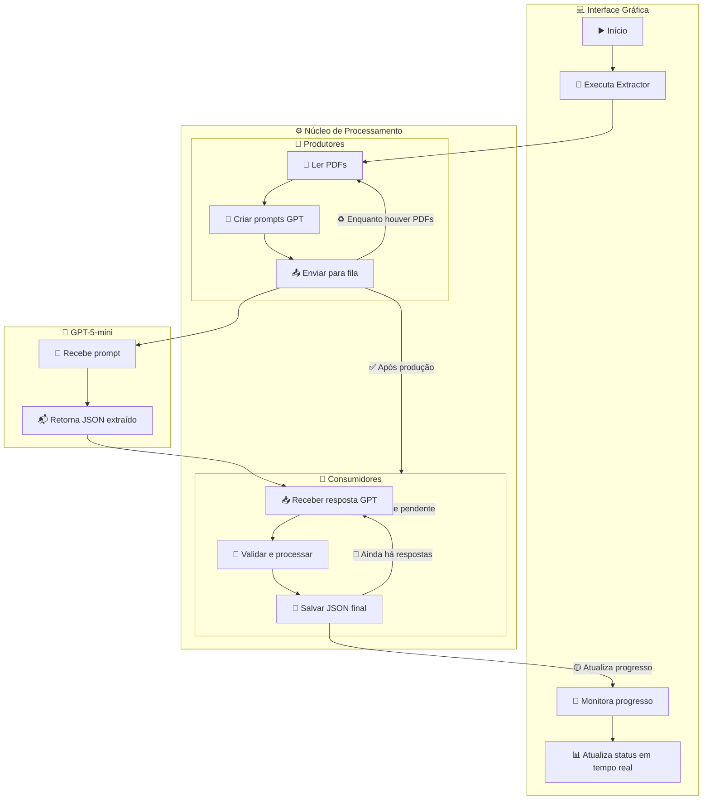

# 🧠 PDF Data Extractor com GPT-5-mini

- Um sistema assíncrono e escalável para extração estruturada de dados a partir de PDFs, utilizando *producers* e *consumers* paralelos, e integração com o modelo **GPT-5-mini**.    
- O pipeline é monitorado em tempo real por uma interface gráfica reativa, que exibe progresso, e a resposta em conforme vai sendo processado.  
- A integração tem todas as bibliotecas sendo multi-plataforma mas apenas foi testada em Linux e Windows.  
- OBS: para usuários MAC não deve apresentar problemas mas talvez algumas configurações internas possam atrapalhar o desempenho ou UI. 
---

## ⚙️ Visão Geral

O projeto é composto por **três camadas principais**:

1. **🖥️ Interface Gráfica (UI)** – onde o usuário inicia o processo, acompanha o progresso e visualiza os resultados.
2. **⚙️ Núcleo de Processamento (CORE)** – orquestra produtores e consumidores que interagem com o modelo de IA.
3. **🧠 GPT-5-mini** – responsável por interpretar o texto extraído dos PDFs e retornar o JSON padronizado com os campos definidos.

---

## 🧩 Arquitetura do Sistema

## 🔁 Fluxo de Execução

    O usuário inicia o processo na interface e seleciona os PDFs.

    A UI chama a função Extractor, que inicializa N produtores e M consumidores.

    Cada produtor:

        Lê um arquivo PDF.

        Gera o prompt no formato esperado pelo modelo.

        Envia o prompt para uma fila assíncrona.

    O modelo GPT-5-mini processa os prompts e retorna o JSON com os campos extraídos.

    Os consumidores:

        Leem as respostas do modelo.

        Validam e limpam os dados.

        Salvam os resultados em um arquivo final (respostas.json).

        Repetem o ciclo enquanto houver itens na fila.

    A UI monitora continuamente o arquivo json/result.json e atualiza o progresso em tempo real.

## 🧰 Tecnologias Utilizadas  
- Python 3.11+	Base da aplicação  
- asyncio / threading	Gerenciamento paralelo de produtores e - consumidores  
- GPT-5-mini API	Extração inteligente de dados dos textos  
- PyQt6 Interface gráfica  

## 🚀 Execução
1. Instalação das dependências

    `pip install -r requirements.txt`
2. Faça um arquivo .env com a sua chave API da open-ai
    `OPENAI_API_KEY="SUA_CHAVE_AQUI"`
3. Execução normal (com UI)

    `python3 main.py`

4. Selecione os pdf que queira ler pode ser tanto selecionando os pdf quanto a pasta em que eles estão e qual schema.json quer usar ( default: dataset.json ) 
 
5. Resultado

    Arquivo de saída: json/result.json ou na interface gráfica

## 💡 Características Avançadas

    🚀 Interface gráfica com Resposta atualizada para o cliente ter noção do que está acontecendo

    ✅ Produtores se transformam automaticamente em consumidores quando terminam suas tarefas para maximizar eficiência.

    🔄 Loops contínuos até o esvaziamento completo das filas.

    ⚡ Processamento paralelo otimizado.

    🧩 Modular e expansível — fácil adicionar novos documentos.

    📡 Comunicação assíncrona entre componentes.

## 🧑‍💻 Estrutura de Pastas
📁 projeto/  
├── main.py  
├── extractor.py  
├── test/ # this folder is for developer test's only  
│   ├── func_test.py  
│   └── gabarito.json  
├── json/  
│   ├── pdfs/  
│   ├── dataset.json  
│   ├── files_to_process.json  
│   └── respostas.json 
├── .env  
└── README.md  
## 🧠 Processo de Desenvolvimento

Durante o desenvolvimento deste projeto, meu foco foi entender o problema e dividi-lo em etapas bem definidas:

1. **Interface (UI)** – Criei uma interface simples e funcional para interagir com o processo.  
2. **Formatação do Prompt** – Estruturei o texto de entrada para garantir que a IA recebesse as informações da forma mais eficiente possível.  
3. **Envio à IA** – Implementei a comunicação com o modelo, garantindo consistência entre as chamadas.  
4. **Cache de Resultados** – Adicionei cache para evitar repetições desnecessárias e otimizar custos.  
5. **Formatação da Resposta** – Estruturei a saída para análise posterior e testes de validação.  

Na **reunião de terça-feira**, descobri que o processo poderia ser **assíncrono** des de que a primeira resposta chegasse em menos de 10s, o que me levou a pensar em um **modelo de produtor e consumidor** para maximizar a eficiência.  
Fui testando para o meu sistema e percebi que conseguia uma quantidade grande de consumidores sem risco de falhar na minha infraestrura pessoal que é bem básica então ficou tão rápido que precisei **ampliar a base de dados de PDFs** — fazendo ele processar **6 arquivos, 200 vezes cada**, mantendo o mesmo consumo de tokens por chamada.  

Porém, como o código estava processando em poucos lotes de chamada o cache acabou apenas **aumentando o tamanho do prompt**, decidi **removê-lo** para simplicar e diminuir a quantidade de tokens de entrada e focar na velocidade pura do processamento.  

Por fim, criei uma **função de teste** para validar a **acurácia dos resultados**, garantindo que o texto final estivesse coerente e bem gerado.

## 🧩 Desafios encontrados

As requisições já estavam bem econômicas e rápidas, então o próximo passo foi buscar formas de aumentar a eficiência geral, mesmo com o tempo fixo de cada chamada à API.

A solução foi implementar um modelo de produtor e consumidor assíncrono, permitindo processar múltiplos PDFs em paralelo e atualizar os resultados em tempo real.

Além disso, busquei otimizar cada etapa — desde a leitura dos PDFs com o PyMuPDF (fitz) até o cache e escrita incremental dos resultados — sempre priorizando bibliotecas focadas em velocidade e baixo overhead.
## 🧑‍🎓 Autor

Desenvolvido por **Gabriel Saboya**
